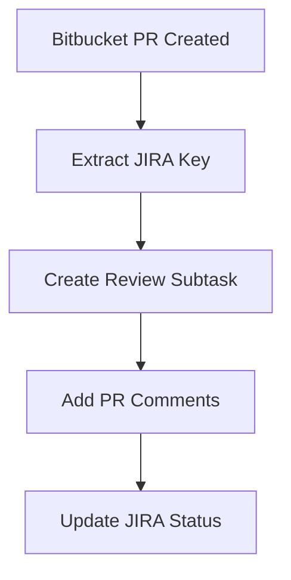

# MCP Tools Interface Documentation

## 📋 Overview

This document provides comprehensive documentation for the Multi-Context Protocol (MCP) tools interfaces across all services in the ProCode platform. Each service exposes its functionality through standardized MCP tools that can be called from VSCode or other MCP-compatible clients.

## 🏗️ Tool Architecture

### Standard Tool Structure
```python
{
    "name": "tool_name",
    "description": "Tool description",
    "inputSchema": {
        "type": "object",
        "properties": {
            "parameter": {"type": "string", "description": "Parameter description"}
        },
        "required": ["required_parameters"]
    }
}
```

### Response Format
```python
{
    "content": [
        {
            "type": "text", 
            "text": "Response content"
        }
    ]
}
```

## 🔧 Confluence Tools Interface

**File**: `servers/confluence/tools.py` (929 lines)

### Core Tools

#### 1. `health_check_confluence`
**Purpose**: Verify Confluence service connectivity and credentials
**Parameters**: None
**Returns**: Service status and configuration validation

#### 2. `get_pages_as_markdown`
**Purpose**: Fetch and convert Confluence pages to markdown
**Parameters**:
- `page_ids` (optional): List of specific page IDs
- `space_key` (optional): Space key for bulk retrieval

**Features**:
- **Bulk Processing**: Handle multiple pages simultaneously
- **Markdown Conversion**: Clean, readable markdown output
- **Metadata Preservation**: Maintains page metadata and structure
- **Error Handling**: Graceful failure with detailed error messages

#### 3. `search_confluence_pages`
**Purpose**: Execute CQL (Confluence Query Language) searches
**Parameters**:
- `query`: CQL search string
- `space_key` (optional): Limit search to specific space
- `limit` (default: 25): Maximum results to return

**Search Capabilities**:
- **Full CQL Support**: Complete Confluence Query Language
- **Space Filtering**: Optional space-specific searches
- **Relevance Scoring**: Results ranked by relevance
- **Rich Metadata**: Comprehensive result information

#### 4. `get_confluence_spaces`
**Purpose**: Retrieve available Confluence spaces
**Parameters**:
- `limit` (default: 50): Maximum spaces to return

**Space Information**:
- **Personal Spaces**: User-specific spaces
- **Team Spaces**: Project and team collaboration spaces
- **Global Spaces**: Organization-wide spaces
- **Permissions**: Access level information

#### 5. `get_page_by_title`
**Purpose**: Find specific page by exact title match
**Parameters**:
- `title`: Exact page title
- `space_key`: Space containing the page

**Features**:
- **Exact Matching**: Precise title-based lookup
- **Content Expansion**: Full page content and metadata
- **Version Information**: Page version and history data

#### 6. `create_confluence_page`
**Purpose**: Create new Confluence pages with advanced features
**Parameters**:
- `title`: Page title
- `content`: Page content (supports markdown)
- `space_key`: Target space
- `parent_page_id` (optional): Parent page for hierarchy
- `labels` (optional): Page labels for organization

**Advanced Features**:
- **Markdown Support**: Automatic markdown to Confluence conversion
- **Hierarchical Organization**: Parent-child page relationships
- **Label Management**: Automatic label application
- **Conflict Resolution**: Handles duplicate titles and other conflicts

### Enhanced Documentation Tools

#### 7. `find_documentation_by_keywords`
**Purpose**: Smart keyword-based documentation discovery
**Parameters**:
- `keywords`: List of search terms
- `space_keys` (optional): Target spaces for search
- `include_archived` (default: false): Include archived content

#### 8. `smart_documentation_search`
**Purpose**: Intelligent documentation search with context
**Parameters**:
- `search_term`: Primary search query
- `context_type`: Type of documentation (API, user guide, troubleshooting)
- `team_context` (optional): Team-specific context

#### 9. `get_space_documentation`
**Purpose**: Comprehensive space documentation analysis
**Parameters**:
- `space_key`: Target space for analysis
- `include_metadata` (default: true): Include detailed metadata

#### 10. `analyze_documentation_gaps`
**Purpose**: Identify missing or outdated documentation
**Parameters**:
- `project_context`: Project or component context
- `minimum_freshness_days` (default: 90): Age threshold for outdated content

#### 11. `get_related_documentation`
**Purpose**: Find related documentation based on content analysis
**Parameters**:
- `reference_page_id`: Base page for relationship analysis
- `similarity_threshold` (default: 0.7): Similarity matching threshold

## 🎯 JIRA Tools Interface

**File**: `servers/jira/tools.py` (761 lines)

### Core Tools

#### 1. `health_check_jira`
**Purpose**: Verify JIRA service connectivity and authentication
**Parameters**: None
**Returns**: Authentication status and API connectivity

#### 2. `get_jira_ticket_details`
**Purpose**: Retrieve comprehensive ticket information
**Parameters**:
- `ticket_key`: JIRA ticket key (e.g., "PROJ-123")

**Ticket Information**:
- **Basic Fields**: Summary, description, status, priority
- **Assignment**: Assignee and reporter information
- **Project Context**: Project and component details
- **Workflow**: Status transitions and history

#### 3. `search_jira_issues`
**Purpose**: Execute JQL (JIRA Query Language) searches
**Parameters**:
- `query`: JQL search string
- `max_results` (default: 50): Maximum results to return

**Search Features**:
- **Full JQL Support**: Complete JIRA Query Language
- **Field Selection**: Optimized field retrieval
- **Safe Processing**: Handles missing fields gracefully
- **Result Formatting**: Standardized response structure

#### 4. `create_review_task`
**Purpose**: Create subtasks for code review implementation
**Parameters**:
- `parent_ticket_key`: Parent story or epic key
- `review_title`: Task title
- `review_description`: Task description
- `assignee` (optional): Task assignee

**Subtask Features**:
- **Parent Linking**: Automatic parent-child relationship
- **Project Inheritance**: Inherits project settings
- **Workflow Integration**: Follows team workflow patterns

#### 5. `create_user_story`
**Purpose**: Create user stories with custom product management fields
**Parameters**:
- `project_id`: Target project ID
- `summary`: Story summary
- `as_an` (optional): User role ("As an...")
- `want_to` (optional): User desire ("I want to...")
- `so_that` (optional): Business value ("So that...")
- `acceptance_criteria` (optional): Definition of done
- `priority_id` (default: "6"): Priority level

**Custom Fields**:
- **Product Template**: Full user story template support
- **Team Assignment**: Squad/theme integration
- **Workflow Mapping**: Custom workflow state handling

#### 6. `get_jira_projects`
**Purpose**: List and search JIRA projects
**Parameters**:
- `search_term` (optional): Filter projects by name
- `max_results` (default: 50): Maximum projects to return

## 🔀 Bitbucket Tools Interface

**File**: `servers/bitbucket/tools.py` (581 lines)

### Core Tools

#### 1. `health_check_bitbucket`
**Purpose**: Verify Bitbucket service connectivity and authentication
**Parameters**: None
**Returns**: Authentication status and API connectivity

#### 2. `analyze_pr_from_link`
**Purpose**: Comprehensive pull request analysis from URL
**Parameters**:
- `pr_link`: Full Bitbucket PR URL

**Analysis Features**:
- **URL Parsing**: Automatic workspace/repo/PR extraction
- **PR Details**: Title, description, status, reviewers
- **Diff Analysis**: Complete code diff information
- **JIRA Integration**: Automatic JIRA ticket extraction from title

#### 3. `add_pr_comment`
**Purpose**: Add comments to pull requests
**Parameters**:
- `pr_link`: Target PR URL
- `comment_text`: Comment content
- `line_number` (optional): Specific line for inline comments

**Comment Features**:
- **Rich Text**: Formatted comment support
- **Inline Comments**: Line-specific code comments
- **Thread Management**: Comment threading support

#### 4. `get_reviewed_prs`
**Purpose**: Find PRs reviewed by specific users
**Parameters**:
- `workspaces`: List of workspace names
- `repo_slugs`: List of repository names
- `username`: Reviewer username
- `state` (default: "ALL"): PR state filter
- `limit` (default: 25): Maximum results

**Review Analysis**:
- **Multi-Repository**: Cross-repository search
- **User Activity**: Reviewer participation tracking
- **State Filtering**: Open, merged, declined PR states

#### 5. `get_repository_info`
**Purpose**: Retrieve repository metadata and configuration
**Parameters**:
- `workspace`: Workspace name
- `repo_slug`: Repository name

#### 6. `get_repository_branches`
**Purpose**: List repository branches with filtering
**Parameters**:
- `workspace`: Workspace name
- `repo_slug`: Repository name
- `filter_text` (optional): Branch name filter

#### 7. `get_commit_details`
**Purpose**: Retrieve detailed commit information
**Parameters**:
- `workspace`: Workspace name
- `repo_slug`: Repository name
- `commit_id`: Commit hash or reference

#### 8. `create_pull_request`
**Purpose**: Create new pull requests programmatically
**Parameters**:
- `workspace`: Workspace name
- `repo_slug`: Repository name
- `source_branch`: Source branch name
- `target_branch`: Target branch name
- `title`: PR title
- `description` (optional): PR description
- `reviewers` (optional): List of reviewer usernames

## 🔗 Cross-Service Integration Patterns

### 1. Documentation-Driven Development


### 2. Code Review Workflow


### 3. Knowledge Management


## 📊 Tool Usage Analytics

### Response Time Targets
- **Health Checks**: < 2 seconds
- **Simple Queries**: < 5 seconds  
- **Complex Searches**: < 15 seconds
- **Content Creation**: < 10 seconds

### Error Handling Standards
- **Authentication Errors**: Clear credential guidance
- **Network Issues**: Retry mechanisms with exponential backoff
- **API Limits**: Rate limiting compliance and queuing
- **Data Validation**: Input validation with helpful error messages

### Logging and Monitoring
- **Request Tracking**: Unique request IDs for debugging
- **Performance Metrics**: Response time and success rate monitoring
- **Error Analysis**: Detailed error categorization and reporting
- **Usage Patterns**: Tool usage analytics for optimization

## 🛠️ Development Guidelines

### Adding New Tools
1. **Define Tool Schema**: Input parameters and descriptions
2. **Implement Handler**: Core logic and error handling
3. **Add Registration**: Register tool in MCP server
4. **Write Tests**: Unit and integration testing
5. **Update Documentation**: Tool documentation and examples

### Tool Naming Conventions
- **Verb-Noun Pattern**: `get_confluence_pages`, `create_jira_ticket`
- **Service Prefix**: Include service name for clarity
- **Action Clarity**: Clear action indication (get, create, update, delete)

### Parameter Standards
- **Required Parameters**: Minimal required inputs
- **Optional Parameters**: Sensible defaults provided
- **Validation**: Input validation with clear error messages
- **Documentation**: Comprehensive parameter descriptions

This comprehensive tools interface provides a unified, powerful API for interacting with the entire Atlassian ecosystem through VSCode and other MCP-compatible clients. 